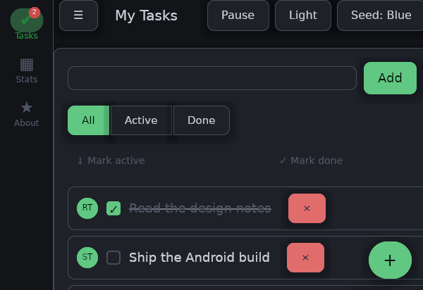
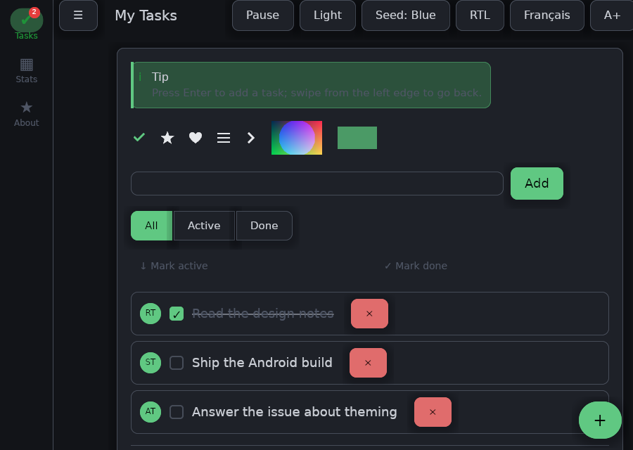
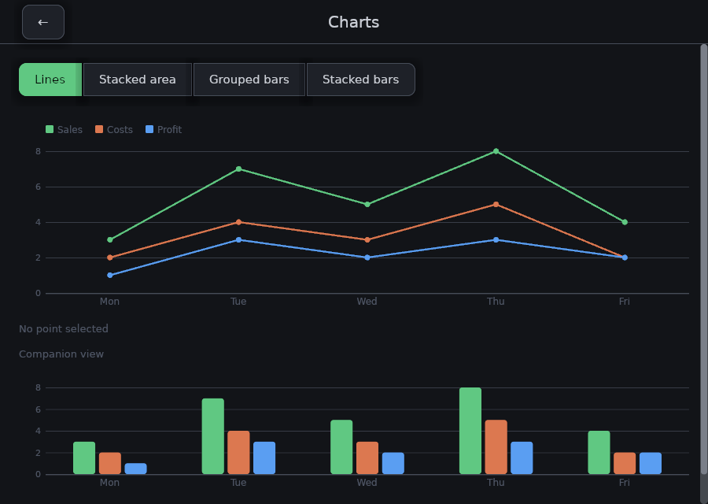
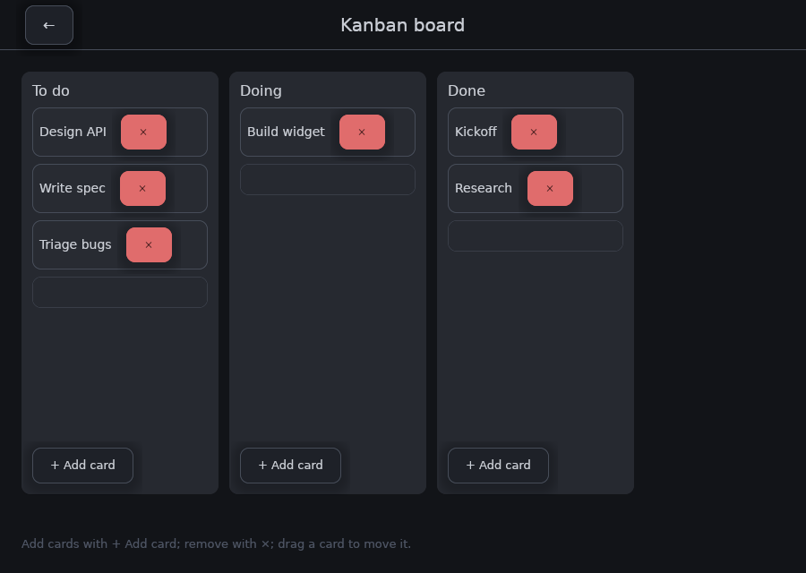
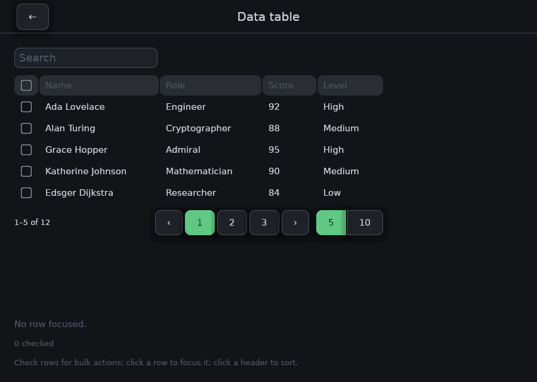
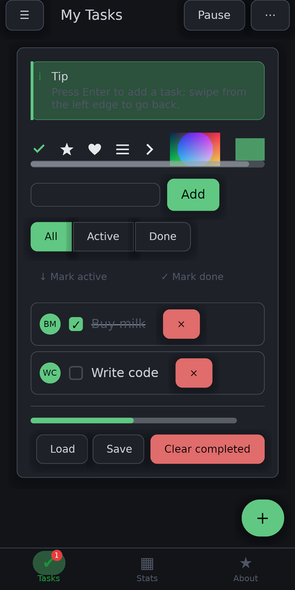
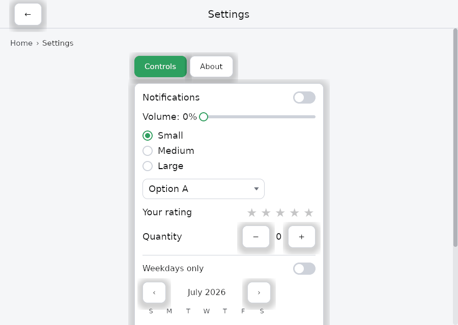

<div align="center">


# frus

**A cross-platform UI framework written entirely in Rust.**

One codebase → desktop, Android, and the web. GPU-rendered. Elm-shaped. No DSL, no codegen, no bespoke CLI — just `cargo`.

[](https://github.com/KalybosPro/frus/actions/workflows/ci.yml)
[](#license)
[](https://www.rust-lang.org)
[](#project-status)

[Quick start](#quick-start) · [Gallery](#what-it-looks-like) · [Architecture](#architecture) · [Status](#project-status) · [Contributing](CONTRIBUTING.md) · [Français](README.fr.md)

<br>



<sub>The sample application moving between four of its screens. Every pixel — the layout, the type, the charts, the springs — is drawn by frus on the GPU.</sub>

</div>

---

## What is frus?

frus is a greenfield attempt at a UI framework designed in Rust from day one: **the entire framework — renderer, layout, widgets, gestures, theming, animation, accessibility — is Rust**. There is no embedded VM, no second language for app logic, and no platform channel between your code and the pixels.

The parts that *must* be native (window creation, IME, screen readers, the Android activity) live behind one thin crate, `frus-shell`. Everything above it is portable.

```rust
use frus::{button, column, row, text, Align, Application, Command, Theme, Variant, Widget};

#[derive(Default)]
struct Counter { count: i32 }

#[derive(Clone)]
enum Msg { Increment, Decrement }

impl Application for Counter {
    type Message = Msg;

    // `update` is pure — testable with no GPU and no window.
    fn update(&mut self, message: Msg) -> Command<Msg> {
        match message {
            Msg::Increment => self.count += 1,
            Msg::Decrement => self.count -= 1,
        }
        Command::none()
    }

    fn view(&self, _theme: &Theme, _w: f32, _h: f32) -> Box<dyn Widget<Msg>> {
        Box::new(column![
            text(format!("{}", self.count)).size(48.0),
            row![
                button("+", Msg::Increment).variant(Variant::Primary),
                button("−", Msg::Decrement).variant(Variant::Secondary),
            ].gap(20.0),
        ].gap(16.0).align(Align::Center))
    }
}

// One declaration wires up desktop, Android and web entry points.
frus::main!(Counter::default());
```

That is a complete, runnable application. `cargo run` on desktop, `cargo apk run` on Android, `wasm-bindgen` for the browser — the source does not change.

### Why another UI framework?

| | |
|---|---|
| **One language, top to bottom** | App logic, widgets, layout, and the renderer are all Rust. No FFI boundary in the hot path, no serialization across a bridge. |
| **Pure `update`, testable core** | The Elm architecture means your state machine is a pure function. ~970 of this repo's tests run with no GPU and no window. |
| **GPU-native rendering** | `wgpu` targets Vulkan, Metal, DX12, and WebGPU from one backend. Vector paths are tessellated with `lyon`; text is shaped by `cosmic-text`. |
| **Everything is overridable** | Widgets ship themed defaults, never hardcoded ones. If a widget paints it, you can restyle it or swap the slot. |
| **cargo-native** | No `frus doctor`, no custom package manager, no generated build directory. `cargo build`, `cargo test`, `cargo apk run`. |

## What it looks like

All of this is one application — `crates/frus-demo` — and one source tree.

| | |
|:--:|:--:|
|  |  |
| **Widgets, gestures, theming** — the list, with drag-and-drop reordering and swipe-to-dismiss. | **Charts** — line, area, grouped and stacked bars, with a legend that filters the series. |
|  |  |
| **Drag-and-drop** — cards move between columns, and the rest reflows live under the finger. | **Data tables** — sorting, selection, pagination, and an inline-editable variant. |

<table>
<tr>
<td width="34%" align="center">

</td>
<td>

**The same code on a phone.** Android is a first-class target, not a port: a native
activity, Vulkan, a real IME with composition and swipe typing, system insets, and
the lifecycle. This is a photograph of a device, not a rendering — it is the one
picture here that would be worth nothing otherwise.



**The theme is not a coat of paint.** Light and dark are generated from a seed
colour, and every widget takes its colours from the theme rather than from a
constant — so an application can restyle the whole library, or one widget, without
forking it.

</td>
</tr>
</table>

<sub>Every picture above except the phone is <b>rendered</b>, through the same pipeline a
window uses: <code>cargo run -p frus-demo --features shots --bin shots -- docs/media</code>.
They are regenerated after a change rather than slowly going stale.</sub>

## Quick start

**Prerequisites:** a recent stable Rust toolchain and a GPU with Vulkan, Metal, or DX12 drivers. (No minimum supported Rust version has been pinned yet — development happens on current stable.)

```sh
git clone https://github.com/KalybosPro/frus
cd frus

cargo run -p frus-hello        # the counter above
cargo run -p frus-demo         # a larger todo/kanban app
cargo run -p frus-transforms   # animation and transform showcase
cargo test --workspace         # ~970 tests
```

### Start your own app

The repo ships a `cargo generate` template that produces a project wired for desktop **and** Android:

```sh
cargo install cargo-generate                          # once
cargo generate --path templates/app --name my-app
cd my-app && cargo run
```

The template asks for the path to your frus checkout — frus is not on crates.io yet, so dependencies resolve through `path`. See [`docs/getting-started.md`](docs/getting-started.md).

### Android

```sh
cargo install cargo-apk        # once
cargo apk run -p frus-demo     # build, install, launch
```

Requires the Android SDK + NDK with `ANDROID_HOME` / `ANDROID_NDK_ROOT` set and a device visible to `adb devices`.

### Web

```sh
rustup target add wasm32-unknown-unknown
cargo install wasm-bindgen-cli

cargo build -p frus-hello --target wasm32-unknown-unknown --profile web-release
wasm-bindgen --target web --no-typescript \
  --out-dir crates/frus-hello/web/pkg \
  target/wasm32-unknown-unknown/web-release/frus_hello.wasm

cd crates/frus-hello/web && python3 -m http.server 8080
```

Needs a WebGPU-capable browser (Chrome/Edge 113+) on a secure context. Details in [`crates/frus-hello/web/README.md`](crates/frus-hello/web/README.md).

## Architecture

Four layers. Dependencies only ever point downward, and only `frus-shell` knows what platform it is on.

```
┌──────────────────────────────────────────────────────────────┐
│  Application     what you write                              │
│  frus (facade) · frus-hello · frus-demo · frus-transforms    │
├──────────────────────────────────────────────────────────────┤
│  Shell           platform layer                              │
│  frus-shell — Application, Command, Subscription,            │
│               lifecycle, IME, a11y, net, main!               │
├──────────────────────────────────────────────────────────────┤
│  Widgets         UI & interaction                            │
│  frus-widgets — Ui/scene, widget tree, gestures, theme       │
├──────────────────────────────────────────────────────────────┤
│  Foundations     render & measure                            │
│  frus-core · frus-layout · frus-text · frus-gpu ·            │
│  frus-image · frus-l10n                                      │
└──────────────────────────────────────────────────────────────┘
```

| Crate | Role |
|---|---|
| [`frus`](crates/frus) | Facade — the single dependency an app needs. Re-exports shell + widgets + `main!`. |
| [`frus-core`](crates/frus-core) | Geometry, color (incl. HCT), paths, decorations, text styles, animation, scene graph, semantics. |
| [`frus-layout`](crates/frus-layout) | Flexbox layout over [`taffy`](https://github.com/DioxusLabs/taffy). |
| [`frus-text`](crates/frus-text) | Shaping and measurement via [`cosmic-text`](https://github.com/pop-os/cosmic-text). |
| [`frus-gpu`](crates/frus-gpu) | `wgpu` device, 2D painter, path tessellation, glyph atlas, compositor, offscreen rendering. |
| [`frus-image`](crates/frus-image) | PNG/JPEG decoding to `ImageData`. |
| [`frus-l10n`](crates/frus-l10n) | i18n via Fluent bundles + locale negotiation. |
| [`frus-widgets`](crates/frus-widgets) | The widget library and interaction model (~80 modules). |
| [`frus-shell`](crates/frus-shell) | Window, event loop, lifecycle, `Command`/`Subscription`, IME, AccessKit, `fetch`. |
| [`frus-test`](crates/frus-test) | Headless rendering, snapshots, golden-image comparison. |
| [`frus-hello`](crates/frus-hello) | The canonical minimal app. Source of the `cargo generate` template. |
| [`frus-demo`](crates/frus-demo) | Larger sample app exercising most widgets. |
| [`frus-fetch-example`](crates/frus-fetch-example) | End-to-end network example: `RemoteData`, loading/error/data states. |
| [`frus-transforms`](crates/frus-transforms) | Animated showcase of transforms, aspect ratio, fractional sizing. |

Read [ARCHITECTURE.md](ARCHITECTURE.md) before your first non-trivial change — it explains where a given kind of code belongs and why.

## Project status

**Pre-alpha.** The core is real and exercised by three sample apps, but the API is not stable and nothing is published to crates.io yet.

| Platform | State | Notes |
|---|---|---|
| **Desktop** (Windows / Linux / macOS) | Working | winit + wgpu, clipboard, screen-reader a11y via AccessKit, dev live-reload |
| **Android** | Working | Native activity, Vulkan, real IME (composition & swipe), insets, lifecycle — validated on device |
| **Web** (wasm + WebGPU) | Functional | Rendering, input, animation, subscriptions, async effects & `fetch`. Clipboard, a11y and live-reload are not wired up |
| **iOS / macOS native** | Not started | The shell layer is isolated, so adding a target is a contained job |

**What works today:** flex/grid/wrap layout, 1D & 2D scrolling with fill-then-scroll, text input with IME, drag-and-drop reordering with live reflow, data tables, editable grids, charts, date/time pickers, dropdowns, trees, toasts, modals, drawers, navigation with spring transitions and back-gesture, an overridable theme, RTL and i18n, spring animations, lifecycle, effects and subscriptions, async HTTP with typed JSON, and golden-image testing.

**Known gaps** — these are the best places to help:

- Publishing to crates.io (everything is `path`-based today).
- Web clipboard, accessibility, and live-reload.
- iOS and native macOS shells.
- Text rendering edge cases, and broader golden coverage.
- A searchable documentation site built from the design notes.

See [ROADMAP.md](ROADMAP.md) for the full picture.

## Where to start

The project is early enough that a single pull request can shape a subsystem. These are
real, open, and written up with where to look and how to know you are done:

| | |
|---|---|
| 🟢 [Give every crate a README](https://github.com/KalybosPro/frus/labels/good%20first%20issue) | Fifteen crates, no front page. **One crate is a perfectly good PR.** |
| 🟢 Pin a minimum supported Rust version | Nobody knows what the floor is. Find it, pin it, add it to CI. |
| 🟢 `NavBar` collapses around its back button | A small, real, already-diagnosed bug, with a way to see it. |
| 🟡 [Publish to crates.io](https://github.com/KalybosPro/frus/labels/help%20wanted) | The single biggest thing between the project and anyone trying it. |
| 🟡 The batch planner is O(n²) | 16× the primitives costs 127× the time. Benchmark included. |
| 🟡 Clipboard and accessibility on the web | Both exist on desktop; the web drops them on the floor. |
| 🔴 [An iOS shell](https://github.com/KalybosPro/frus/labels/design%20first) | The architecture bets this is a contained job. Nobody has tested the bet. |

🟢 good first issue · 🟡 help wanted · 🔴 design first — [all open issues](https://github.com/KalybosPro/frus/issues)

Not sure where you fit? Open an issue and say what you enjoy working on. English or
French, both fine.

## Contributing

Start with **[CONTRIBUTING.md](CONTRIBUTING.md)**. The short version:

```sh
cargo test --workspace          # must be green
cargo clippy --workspace --all-targets
cargo fmt --all
```

Every change ships with tests; every non-trivial change ships with a design note. Discussion happens in [issues](https://github.com/KalybosPro/frus/issues) and [discussions](https://github.com/KalybosPro/frus/discussions) — English or French, both fine.

By participating you agree to the [Code of Conduct](CODE_OF_CONDUCT.md).

## Documentation

- [Getting started](docs/getting-started.md) — write and run your first app
- [Structuring an application](docs/app-structure.md) — splitting a growing app across modules
- [Architecture](ARCHITECTURE.md) — how the crates fit together
- [Roadmap](ROADMAP.md) — what's next and where help is wanted
- [Design notes index](docs/README.md) — 304 notes, one per milestone: the analysis, the alternatives considered, the decision, and why. This is the project's real memory.

## License

Licensed under either of

- Apache License, Version 2.0 ([LICENSE-APACHE](LICENSE-APACHE))
- MIT license ([LICENSE-MIT](LICENSE-MIT))

at your option.

Unless you explicitly state otherwise, any contribution intentionally submitted for inclusion in the work by you, as defined in the Apache-2.0 license, shall be dual licensed as above, without any additional terms or conditions.
